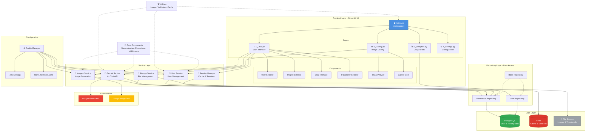

```mermaid
    graph TB
        subgraph "Frontend Layer - Streamlit UI"
            UI[🖥️ Main App<br/>src/ui/app.py]
            
            subgraph "Pages"
                P1[💬 1_Chat.py<br/>Main Interface]
                P2[🖼️ 2_Gallery.py<br/>Image Gallery]
                P3[📊 3_Analytics.py<br/>Usage Stats]
                P4[⚙️ 4_Settings.py<br/>Configuration]
            end
            
            subgraph "Components"
                C1[User Selector]
                C2[Project Selector]
                C3[Chat Interface]
                C4[Parameter Selector]
                C5[Image Viewer]
                C6[Gallery Grid]
            end
            
            UI --> P1
            UI --> P2
            UI --> P3
            UI --> P4
            
            P1 --> C1
            P1 --> C2
            P1 --> C3
            P1 --> C4
            P2 --> C5
            P2 --> C6
        end
        
        subgraph "Service Layer"
            US[👤 User Service<br/>User Management]
            GS[🤖 Gemini Service<br/>AI Chat API]
            IS[🎨 Imagen Service<br/>Image Generation]
            SS[💾 Storage Service<br/>File Management]
            SM[🔄 Session Manager<br/>Cache & Sessions]
        end
        
        subgraph "Repository Layer - Data Access"
            UR[User Repository]
            GR[Generation Repository]
            BR[Base Repository]
            
            BR -.-> UR
            BR -.-> GR
        end
        
        subgraph "Data Layer"
            DB[(PostgreSQL<br/>User & History Data)]
            REDIS[(Redis<br/>Cache & Sessions)]
            FS[📁 File Storage<br/>Images & Thumbnails]
        end
        
        subgraph "Configuration"
            CFG[⚙️ Config Manager]
            ENV[.env Settings]
            YAML[team_members.yaml]
            
            CFG --> ENV
            CFG --> YAML
        end
        
        subgraph "External APIs"
            GEMINI[Google Gemini API]
            IMAGEN[Google Imagen API]
        end
        
        %% Frontend to Services
        P1 --> US
        P1 --> GS
        P1 --> IS
        P1 --> SM
        P2 --> SS
        P3 --> GR
        
        %% Services to Repositories
        US --> UR
        GS --> GR
        IS --> GR
        SS --> GR
        
        %% Repositories to Data
        UR --> DB
        GR --> DB
        SM --> REDIS
        SS --> FS
        
        %% Services to External APIs
        GS --> GEMINI
        IS --> IMAGEN
        
        %% Config to Services
        CFG --> US
        CFG --> GS
        CFG --> IS
        CFG --> SS
        
        %% Core Components
        CORE[🔧 Core Components<br/>Dependencies, Exceptions, Middleware]
        CORE -.-> US
        CORE -.-> GS
        CORE -.-> IS
        
        UTILS[🛠️ Utilities<br/>Logger, Validators, Cache]
        UTILS -.-> UI
        UTILS -.-> US
        UTILS -.-> GS
        
        style UI fill:#4A90E2,stroke:#2E5C8A,color:#fff
        style GEMINI fill:#EA4335,stroke:#C5221F,color:#fff
        style IMAGEN fill:#FBBC04,stroke:#F9AB00,color:#fff
        style DB fill:#34A853,stroke:#188038,color:#fff
        style REDIS fill:#DC382D,stroke:#A41E11,color:#fff
        style FS fill:#9AA0A6,stroke:#5F6368,color:#fff
```